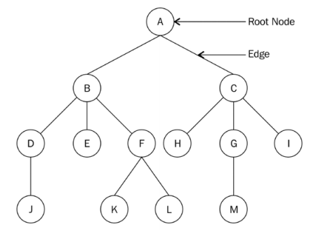

# Most notes will be from [1. Hands-On Data Structures & Algorithms with Python - Store, Manipulate, & Access Data Effectively(2022, 3E, Packt)](https://www.packtpub.com/en-us/product/hands-on-data-structures-and-algorithms-with-python-9781801073448?type=print&gad_source=1), [2. Data Structures & Algorithms in Python - Developers Library(2022, 1E, Addison-Wesley)](https://a.co/d/4xThIzs), and finally, [3. A Common-Sense Guide to Data Structures & Algorithms(2020, 2E, Pragmatic)](https://a.co/d/bbxU7kM)
## Chapter 6 of 1 - Trees
A `Tree` is a hierachical form of data structure. Data structures such as lists, queues, and stacks are linear in that the items are stored in a sequential way. However, a tree is a non-linear data structure, as there is a **parent-child relationship** between the items. The top of the tree's data structure is known as a `root node`. This is the ancestor of all other nodes in the tree.

Tree data structures are very important, owing to their use in various applications, such as parsing expressions, efficient searches, and priority queues. Certain document types, such as XML and HTML, can also be represented in a tree.

Topics covered:
    - Terms & definitions of trees
    - Binary trees and binary search trees
    - Tree traversal
    - Binary search trees

### Terminology




- **Node**: Each circled letter in the image above represents a node. A node is any data structure that stores data.
- **Root Node**: First node from which all other nodes in the tree descend from. In other words, a root node is a node that doesnt have a parent node. In every tree, there is always one unique root node. The root node is node $A$ in the above image.
- **Subtree**: Tree whose nodes descend from some other tree. For example, in the image above for example, nodes $F$, $K$, and $L$ form a subtree of the original tree.
- **Degree**: The total number of children of a given node is called the `degree of the node`. A tree consisting of only one node has a degree of 0. The degree of node $A$ in the preceeding diagram is 2, the degree of node $B$ is 3, the degree of node $C$ is 3 and, the degree of node $G$ is 1.
- **Leaf Node**: Leaf nodes dont have any children and are the terminal node of a given tree. The degree of a leaf node is *always* 0. In the preceeding diagram, the nodes $J$, $E$, $K$, $L$, $H$, $M$, and $I$ are all leaf nodes.
- **Edge**: The connection between any given two nodes in a tree is called an *edge*. The total number of edges in a given tree will be a maximum of one less than the total nodes in the tree.

  >> $1 - N_{tot}$

```{mermaid}
graph TB
    %% A((1)) --> B((2))
    %% A --> C((3))
    %% B --> D((4))
    %% B --> E((5))
    %% B --> F((6))
    %% D --> J((10))
    %% F --> K((11))
    %% F --> L((12))
    %% C --> H((7))
    %% C --> I((9))
    %% C --> G((8))
    %% G --> M((13))
    A --> B
    A --> C
    B --> D
    B --> E
    B --> F
    D --> J
    F --> K
    F --> L
    C --> H
    G --> M
    C --> I
    C --> G
```

- **Parent**: A node that has a subtree is the parent node of that subtree. For example, node $B$ is the parent of nodes $D$, $E$, and $F$, and node $F$ is the parent of nodes $K$ and $L$.
- **Child**: This is a node that is descendant from a parent node. For example, nodes $B$ and $C$ are children of parent node $A$, while nodes $H$, $G$, and $I$ are the children of parent node $C$.
- **Sibling**: All nodes with the same parent node are siblings. For example, node $B$ is the sibling of node $C$, and, similarly, nodes $D$, $E$, and $F$ are also siblings.
- **Level**: The root node of the tree is considered to be at level 0. The children of the root node are considered to be at level 1, and the children of the nodes at level 1 are considered to be at level 2, and so on. For example, in root node $A$ is at level 0, nodes $B$ and $C$ are at level 1, and nodes $D$, $E$, $F$, $H$, $G$, and $I$ are at level 2.
- **Height of a tree**: The total number of nodes in the longest path of the tree is the height of the tree. For example, the height of the tree is 4, as the longest paths, A-B-D-J, A-C-G-M, and A-B-F-K, all have a total number of four nodes each.
- **Depth**: The depth of a node is the number of edges from the root of the tree to that node.
In the preceding tree example, the depth of node $H$ is 2.

### Binary Trees

```{mermaid}
graph TB;
    1 --> 2
    1 --> 3
    2 --> 4
    2 --> 5
    3 --> 6
    3 --> 7
```
```{python}
class Node:
    def __init__(self, data):
      self.data = data
      self.right_child = None
      self.left_child = None


```
To better understand this class, this is the type of tree that will be worked with in the code below.
```{mermaid}
graph TB
  n1 --> n2
  n1 --> n3
  n2 --> n4
```
```{python}
n1 = Node("root node")
n2 = Node("left child node")
n3 = Node("right child node")
n4 = Node("left grandchild node")

n1.left_child = n2
n1.right_child = n3
n2.left_hild = n4

# Tree traversal
current = n1
while current:
    print(current.data)
    current = current.left_child
```

### In-order traversal
```{python}
def inorder(root_node):
    current = root_node
    if current is None:
        return
    inorder(current.left_child)
    print(current.data)
    inorder(current.right_child)

inorder(n1)
```
### Pre-order traversal
```{python}
def preorder(root_node):
    current = root_node
    if current is None:
        return
    print(current.data)
    preorder(current.left_child)
    preorder(current.right_child)

preorder(n1)
```